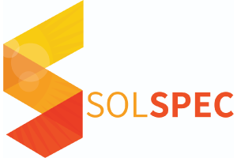

## What is JS.Geo?

JS.Geo is an annual(ish) gathering for anyone with an enthusiasm for code and maps. In our previous gatherings (in Denver, Portland, Philadelphia, and Boston) speakers included devs from organizations you know as well as indie coders doing creative work outside the traditional geospatial industry. It's a single day event that moves fast so as to maximize the number of interesting people and ideas.

JS.Geo V5 is open to anyone and everyone interested in attending, with a special focus on users, developers, and enthusiasts who work in or near geo-friendly spaces. This year, we’re excited to announce that the event will take place following [GeoRodeo](https://tnris.org/georodeo/) - Austin’s annual gathering of geospatial developers. 

### New: Join our Slack!
Planning to attend GeoRodeo / JS.Geo? Unable to attend but want to join the conversation remotely? [Click here to join our Slack channel](https://join.slack.com/t/jsgeorodeo/shared_invite/enQtNTk2OTM0NzM1MDA4LThjNzg5YWJmMjI2MTkxNDE4YzU3OTgxMWYzODZlZTdlM2Q0YzVmN2Q5ZDc4ZDg2NzkzZDQ2NDRjMTg2OTRhODE). All are welcome, invite your friends.

### Venue
This year's event will be co-located with the annual [GeoRodeo](https://tnris.org/georodeo/) conference. Our venue will be Austin’s amazing Central Library, located at [710 W. César Chávez St. Austin, TX, 78701](https://goo.gl/maps/53fzj43xKqk).

### Schedule

<iframe width="99%" height="400px" src="https://docs.google.com/spreadsheets/d/e/2PACX-1vTSlJyDcTDZqIDs6PZpdtb6BiOlxTcEgEYJVhbWICIO2Uuovv8tTh8m-TC9loIKmaPG_cijrafwJB50/pubhtml?gid=500707188&amp;single=true&amp;widget=true&amp;headers=false"></iframe>

[View full schedule](https://docs.google.com/spreadsheets/d/e/2PACX-1vTSlJyDcTDZqIDs6PZpdtb6BiOlxTcEgEYJVhbWICIO2Uuovv8tTh8m-TC9loIKmaPG_cijrafwJB50/pubhtml?gid=500707188&single=true)

### Attend
JS.Geo V5 is free to attend, but seats fills up quickly. To guarantee your spot, [register here now](https://www.eventbrite.com/e/jsgeo-v5-tickets-58757366866). **Note:** registration is not required - walk-ins will be admitted starting at 9am, as long as seats are available.

### Conduct

All sponsors, attendees and participating organizations at JSGeo are required
to agree to our [Code of Conduct](conduct.html). 

### Sponsorship
Like its companion GeoRodeo, JS.Geo V5 is completely free to attend. This is only possible with the support of our sponsors. Through this sponsorship we’re able to cover venue costs and keep JS.Geo accessible to all. This year's sponsors include:

 

 

 

 

If you or your company are interested in being one of our sponsors this year, [reach out and let our organizers know](mailto:jsgeo-organizers@groups.io).
